# Fruit Ripening Monitoring System Using ESP8266 and VOC Sensors

## Table of Contents

- [Overview](#overview)
- [Features](#features)
- [Usage](#usage)
- [Setup](#setup)
  - [Arduino Setup](#arduino-setup)
  - [Python Server Setup](#python-server-setup)
- [Wiring and Connections](#wiring-and-connections)
- [Report Images](#report-images)
- [Future Work](#future-work)
- [Conclusion](#conclusion)

## Overview

This project aims to monitor and analyze the relationship between various gases and fruit ripening. We use an ESP8266 NodeMCU microcontroller with SGP30, HTU21, and SHT20 sensors to gather data on VOC gases, CO2, H2, ethanol, temperature, and humidity. The collected data is sent to a Python server via WebSocket, which can handle multiple clients simultaneously. The data is stored in an SQLite database, cleaned, and prepared for future data mining to find correlations between the gases and fruit ripening.

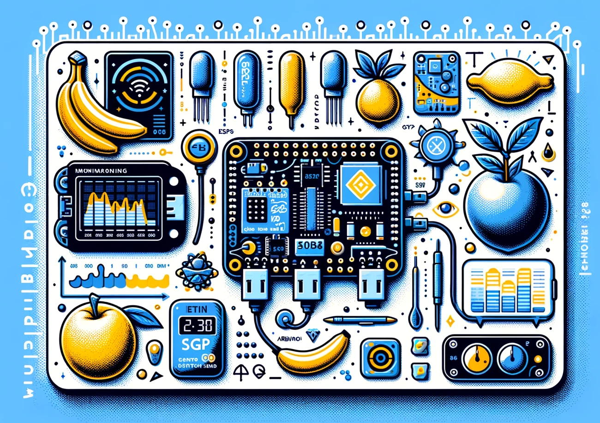

## Features

- **Real-time monitoring**: 
  - Continuous data collection on VOC gases, temperature, and humidity.
  - SGP30 sensor captures VOC gas concentrations.
  - HTU21 and SHT20 sensors measure temperature and humidity.

- **Multiple sensor modules**:
  - Multiple ESP8266 NodeMCU microcontrollers gather data under different conditions.
  - Each microcontroller sends data to the central server.

- **Data communication and storage**:
  - Real-time data transfer via WebSocket.
  - Python server handles multiple client connections.
  - Data stored in an SQLite database.

- **Data cleaning and preprocessing**:
  - Scripts ensure the dataset is free of errors and inconsistencies.
  - Preprocessing includes handling missing values and outlier detection.

- **Future work**:
  - Data mining to identify correlations between gas concentrations and fruit ripening.
  - Use advanced analysis techniques and visualizations.

## Usage

1. **Assemble the hardware**: Connect the SGP30, HTU21, and SHT20 sensors to the ESP8266 NodeMCU.
2. **Upload the Arduino sketch**: Use the Arduino IDE to upload `main.ino` to the ESP8266.
3. **Start the Python server**: Run `server.py` to start the server.
4. **Begin data collection**: The sensors will start collecting data and sending it to the server, which will store it in the SQLite database.

## Setup

### Arduino Setup

1. **Install Arduino IDE**
   - **Manjaro**: `flatpak install cc.arduino.IDE2`
   - **Windows/Mac**: Download from the [official website](https://www.arduino.cc/en/software).

2. **Install ESP8266 Board Package**
   - Go to File > Preferences in the Arduino IDE.
   - Enter the following URL in the "Additional Boards Manager URLs" field:
     ```
     http://arduino.esp8266.com/stable/package_esp8266com_index.json
     ```
   - Click "OK".
   - Open the Boards Manager from Tools > Board > Boards Manager.
   - Search for "ESP8266" and install the "ESP8266 by ESP8266 Community" package.
   - Select the appropriate board from Tools > Board (e.g., NodeMCU 0.9).

3. **Install Required Libraries**
   - Go to Sketch > Include Library > Library Manager.
   - Search for and install the following libraries:
     - `AVision_ESP8266` by A-Vision
     - `ArduinoJson` by Benoit Blanchon
     - `Adafruit SGP30 Sensor` by Adafruit

### Python Server Setup

1. **Install Python**
   - **Manjaro**: `sudo pacman -S python`
   - **Windows/Mac**: Download from the [official website](https://www.python.org/downloads/).

2. **Install Python Websockets**
   - **Manjaro**: `sudo pacman -S python-websockets`
   - **Windows/Mac**: `pip install websockets`

3. **Run Python Server**
   - Execute `pythonServer.py` to start the server.

## Wiring and Connections

To set up the hardware, follow the wiring diagram below. This diagram shows how to connect the ESP8266 NodeMCU microcontroller to the SGP30, HTU21DF, and SHT20 sensors using the SDA and SCL ports. It also includes connections for two LEDs that indicate server connection status and data receiving status.

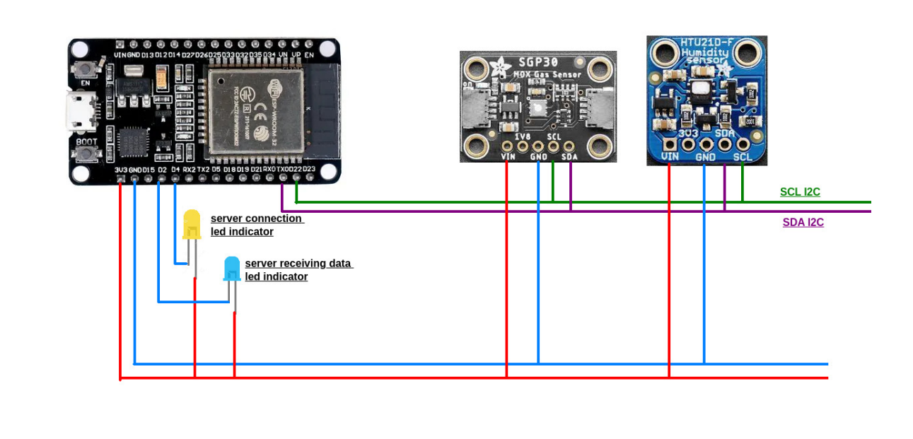

### Connections

- **ESP8266 NodeMCU to SGP30 Sensor**:
  - VIN to 3V3
  - GND to GND
  - SCL to D1 (SCL)
  - SDA to D2 (SDA)

- **ESP8266 NodeMCU to HTU21DF Sensor**:
  - VIN to 3V3
  - GND to GND
  - SCL to D1 (SCL)
  - SDA to D2 (SDA)

- **ESP8266 NodeMCU to SHT20 Sensor**:
  - VIN to 3V3
  - GND to GND
  - SCL to D1 (SCL)
  - SDA to D2 (SDA)

- **LED Indicators**:
  - Server connection LED:
    - Positive to D5
    - Negative to GND
  - Data receiving LED:
    - Positive to D6
    - Negative to GND

## Report Images

- **Banana Ripening Images**:

  Day 1 (11 Nov)  
  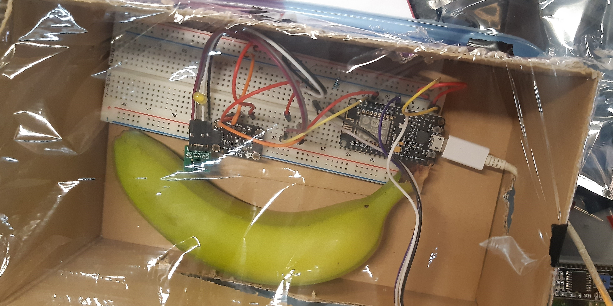  

  Day 2 (12 Nov)  
  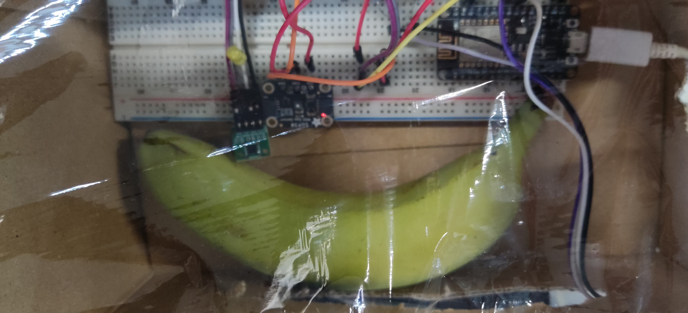  

  Day 3 (13 Nov)  
  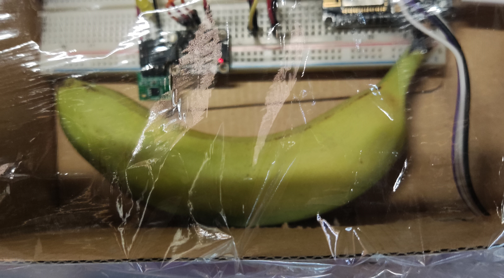  

  Day 4 (14 Nov)  
  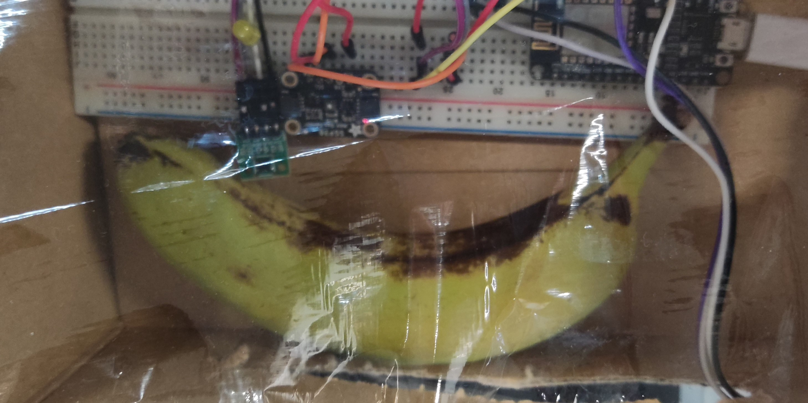  

  Day 5 (15 Nov)  
  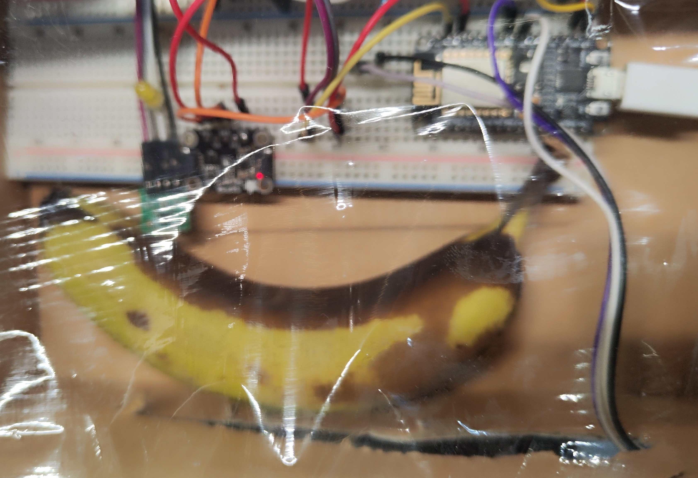  

  Day 6 (16 Nov)  
  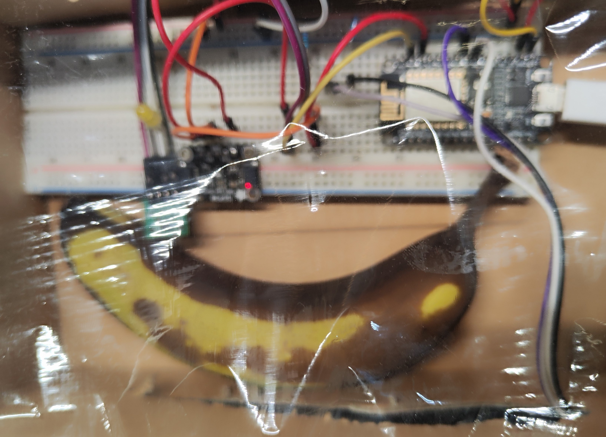  

- **Data Correlation Charts**:

  Gas correlation charts from 11 Nov to 16 Nov (the black line indicates when the banana was in perfect shape).

  VOC hourly chart  
  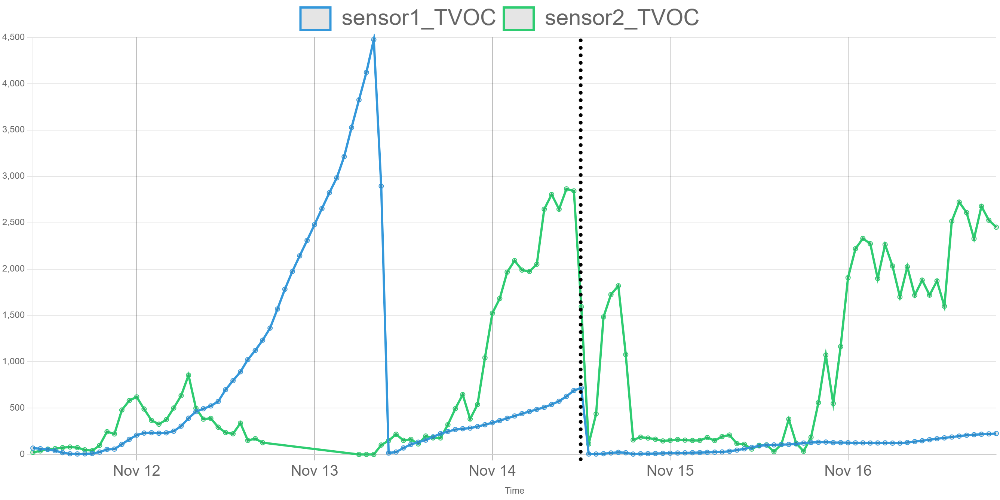  

  CO2 and VOC hourly chart  
  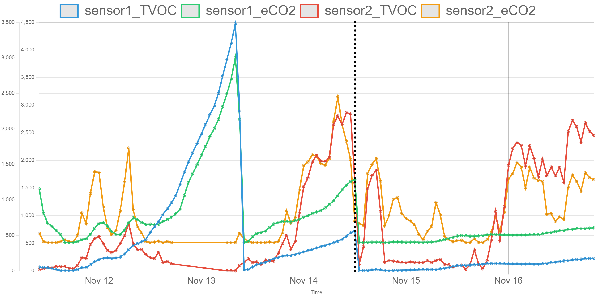  

  H2 and VOC hourly chart  
  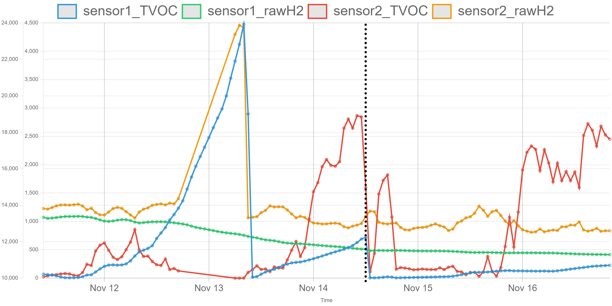  

  Ethanol and VOC hourly chart  
  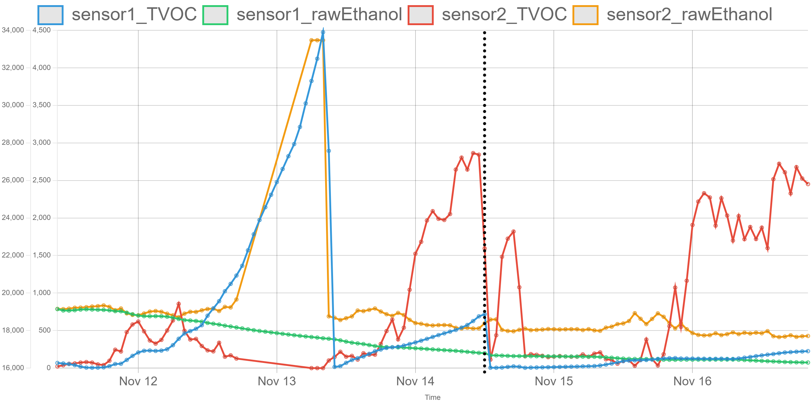  

  Temperature and VOC hourly chart  
  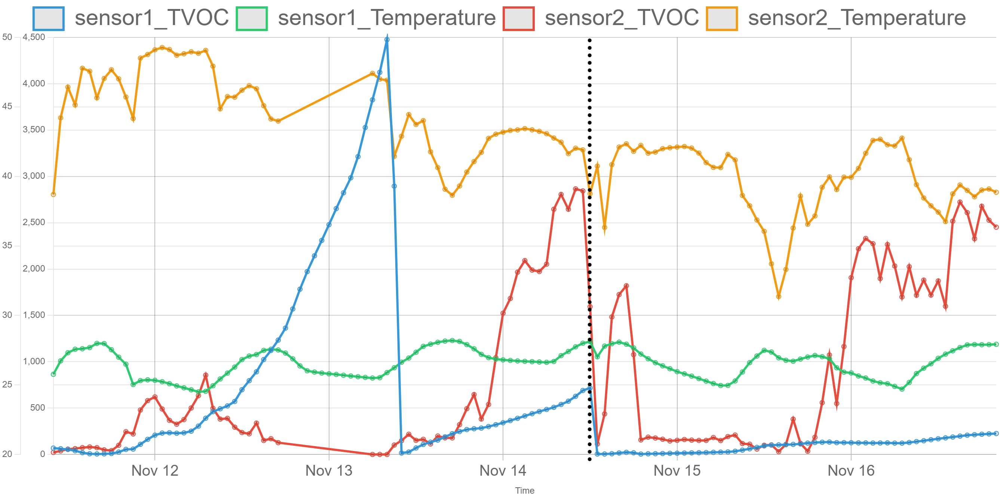  

  Humidity and VOC hourly chart  
  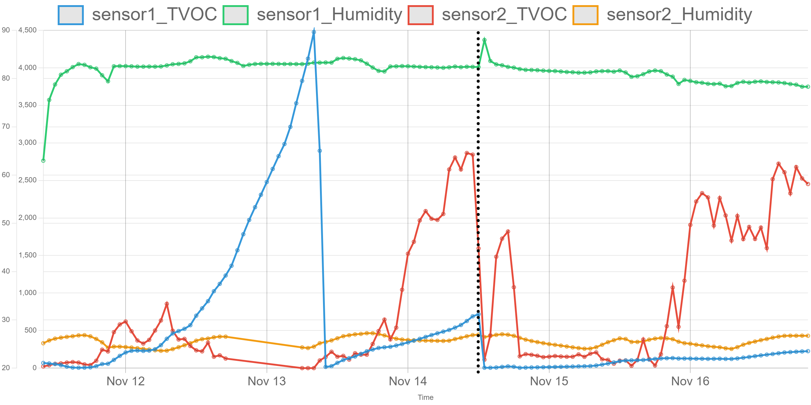  

## Future Work

- **Data Mining**: Analyze the cleaned dataset to find correlations between VOC gases and fruit ripening.
- **Visualization**: Develop visualizations to better understand the relationship between gas levels and the ripening process.
- **Optimization**: Improve the accuracy and efficiency of data collection and analysis.

## Conclusion

This project provides a robust system for monitoring and analyzing fruit ripening using VOC gas sensors and temperature/humidity sensors. The collected data can be used for further analysis to uncover valuable insights into the ripening process.